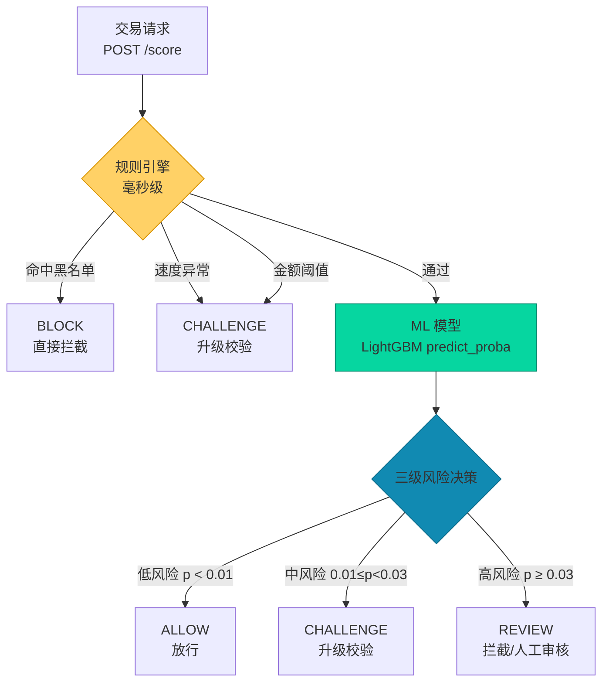
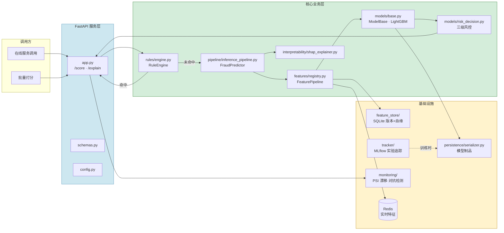
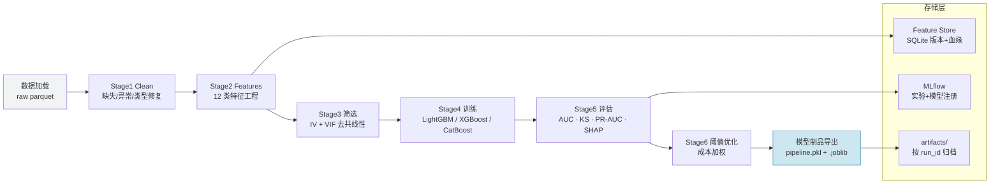

# FraudML — 电商欺诈检测系统


> IEEE-CIS 电商欺诈检测：**规则引擎 + ML 模型双层架构**，含数据泄漏修复、特征工程对比实验、成本优化三层风控决策、FastAPI 在线服务。

---

## 实验结果

| 配置 | AUC | KS | PR-AUC | Prec@5% | 特征数 | 说明 |
|------|-----|-----|--------|---------|--------|------|
| **Hybrid（最佳）** | **0.8942** | **0.6265** | 0.5131 | 0.3812 | 1503 | 原始列 + 时间 + 金额特征 |
| 基线（无特征工程） | 0.8939 | 0.6288 | 0.5153 | 0.3843 | 1494 | 仅使用原始列，无特征工程 |
| 默认（严格 IV 筛选） | 0.8348 | 0.5273 | 0.4384 | 0.3387 | 258 | 完整特征工程 + IV > 0.005 筛选 |
| 完整配置 | 0.8237 | 0.5192 | 0.4360 | 0.3385 | 293 | 全部特征 + 5 模型对比 |

**核心发现**：基于树的模型中，99% 的预测能力来自原始列。多数手工构造的特征（TargetEncoder、CrossFeature、HistoryFeature）引入的是噪声而非信号。只有「树模型无法学习的变换」（时间周期性、对数缩放）能带来微弱收益。

---

## 架构

### 在线打分流程



> **降级模式**：有状态特征（HistoryFeature、AggregationFeature）需要 Redis 提供实时历史上下文。当 Redis 不可用时，服务会标记 `features_degraded=true`，仅使用可用的无状态特征进行打分。

### 系统组件



### 训练流水线



---

## 快速开始

```bash
# 1. 安装
pip install -e ".[dev]"

# 2. 训练（默认配置）
python -m src.train --config-name config_hybrid

# 3. 启动在线服务
export MODEL_ARTIFACT_DIR=artifacts/run_YYYYMMDD_HHMMSS_xxxxxx
uvicorn src.serving.main:app --port 8000

# 4. 对单笔交易打分
curl -X POST http://localhost:8000/score \
  -H "Content-Type: application/json" \
  -d '{"TransactionDT": 3459432, "TransactionAmt": 50, "card1": 17074}'

# 5. 批量打分
fraudml-score --artifact-dir artifacts/run_xxx --data-source data/raw/train_transaction.parquet

# 6. 运行测试
pytest
```

### Docker

```bash
# 训练
docker compose --profile training up training

# 在线 API
docker compose --profile api up api

# MLflow 追踪服务
docker compose --profile mlflow up mlflow
```

---

## 核心设计决策

### 1. 数据泄漏修复

有状态特征（TargetEncoder、HistoryFeature、AggregationFeature）必须仅在训练集上 `fit()`，然后在验证集上 `transform()`。初始版本错误地将训练集+验证集拼接后进行拟合，导致未来的统计量和标签泄漏：

| | AUC（泄漏） | AUC（修复后） | 差值 |
|---|---|---|---|
| 初始运行 | 0.9079 | 0.8939 | -0.014 |

AUC 下降 1.4% 本身就是泄漏存在的证明。

### 2. 特征工程评估

| 特征类型 | 对 LightGBM 的影响 | 原因 |
|---|---|---|
| TimeFeature（小时/星期） | +0.0003 | 树模型无法从原始时间戳中提取周期性 |
| AmountFeature（对数/小数） | +0.0001 | 对数变换有助于确定分裂点 |
| TargetEncoder | -0.01 | 对树模型冗余；存在泄漏风险 |
| CrossFeature | -0.005 | 树模型已能学习特征交互 |
| HistoryFeature | -0.01 | 稀疏（74% 的 UID 仅出现一次） |

**结论**：不要盲目添加特征。对于树模型，需评估每个特征的增量价值——多数「标准」特征工程技术是为线性模型设计的，反而会损害树模型的性能。

### 3. 规则 + 模型双层架构

真实的反欺诈系统会在 ML 打分前使用确定性规则：
- **规则**（毫秒级）：黑名单、速度异常、金额阈值 —— 在无需模型延迟的情况下拦截明显欺诈
- **模型**（100-200ms）：LightGBM 处理规则无法覆盖的「灰色地带」

`/score` 端点返回 `decision_source: "rule_engine" | "model"`，使决策路径可追溯。

### 4. 成本优化的三级风险

阈值并非硬编码 —— 它们基于业务成本权重在验证数据上进行优化：

```yaml
risk_decision:
  cost_fp: 10.0    # 误报成本（客户体验摩擦）
  cost_fn: 500.0   # 漏报成本（欺诈损失）
```

基于 50:1 的成本比，优化器会将阈值压低（中风险=0.01，高风险=0.03），体现「宁可多拦截也不漏掉欺诈」的原则 —— 这对高价值欺诈是正确的权衡。

### 5. 在线降级模式

有状态特征需要历史上下文（Redis 有序集合存储交易窗口）。即便没有 Redis，服务仍可打分，但会标记 `features_degraded=true`，让调用方知晓概率是基于部分特征集得出的。这支持渐进式部署：先上线模型，后续再接入 Redis。

---

## 项目结构

```
fraudml/
├── configs/
│   ├── config.yaml              # 默认（严格 IV，最小特征工程）
│   ├── config_hybrid.yaml       # 时间+金额特征（最佳 AUC）
│   ├── config_full.yaml         # 全部特征 + 模型对比
│   └── config_baseline.yaml    # 无特征工程
├── data/
│   ├── raw/                     # IEEE-CIS parquet 文件
│   └── blacklist.txt            # 高欺诈 card1 值
├── src/
│   ├── data/                    # DataLoader、PolarsDataLoader、make_loader()
│   ├── features/                # FeatureBase 抽象类 + 12 个特征类
│   ├── models/                  # ModelBase 抽象类 + LightGBM/XGBoost/CatBoost 封装
│   │   └── risk_decision.py     # 三级风控引擎
│   ├── pipeline/                # TrainPipeline、FraudPredictor
│   ├── persistence/             # ModelSerializer（模型制品保存/加载）
│   ├── tracker/                 # MLflow ExperimentTracker
│   ├── feature_store/           # SQLite 特征存储（版本管理 + 血缘追踪）
│   ├── serving/                 # FastAPI 应用 + 配置 + Schema
│   ├── rules/                   # RuleEngine（Blacklist/Velocity/Amount）
│   ├── interpretability/        # SHAPExplainer
│   ├── batch_score.py           # 批量打分 CLI
│   └── train.py                 # 训练入口
├── tests/                       # 32 个 pytest 测试
├── Dockerfile                   # 多阶段构建（构建器 + 运行时）
├── docker-compose.yml           # training + mlflow + api 服务
├── pyproject.toml               # PEP 621 标准
└── README.md
```

---

## 配置

| 配置 | 特征工程 | IV 筛选 | AUC |
|------|----------|---------|-----|
| `config_baseline` | 无（仅原始列） | 否 | 0.8939 |
| `config_hybrid` | 时间 + 金额 | 否 | **0.8942** |
| `config` | 完整特征工程（12 步） | > 0.005 | 0.8348 |
| `config_full` | 完整特征工程 + 模型对比 | > 0.0 | 0.8237 |

```bash
# 切换配置
python -m src.train --config-name config_hybrid
```

---

## API 接口

| 方法 | 路径 | 说明 |
|------|------|------|
| POST | `/score` | 对交易打分（规则 → 模型） |
| POST | `/explain` | 打分 + SHAP 关键特征 |
| GET | `/health` | 存活探针 |
| GET | `/ready` | 就绪探针（模型 + 特征存储） |
| GET | `/model-info` | 模型类型、特征、指标 |
| GET | `/rules` | 列出模型前的活跃规则 |
| POST | `/admin/blacklist` | 将 card1 加入黑名单 |

### 响应示例

```json
{
  "transaction_id": 3459432,
  "probability": 0.1769,
  "risk_level": "low",
  "recommended_action": "allow",
  "decision_source": "model",
  "matched_rule": null,
  "features_degraded": true,
  "model_version": "run_20260820_232249"
}
```

---

## 测试

```bash
pytest -v
# 32 个测试：features、feature_store、data、pipeline、serving
```

---

## 数据集

[IEEE-CIS Fraud Detection](https://www.kaggle.com/competitions/ieee-fraud-detection/) —— 来自 Vesta 电商平台的 590,540 笔交易 × 394 列。按时间划分训练/验证集（80/20）以防止时间泄漏。